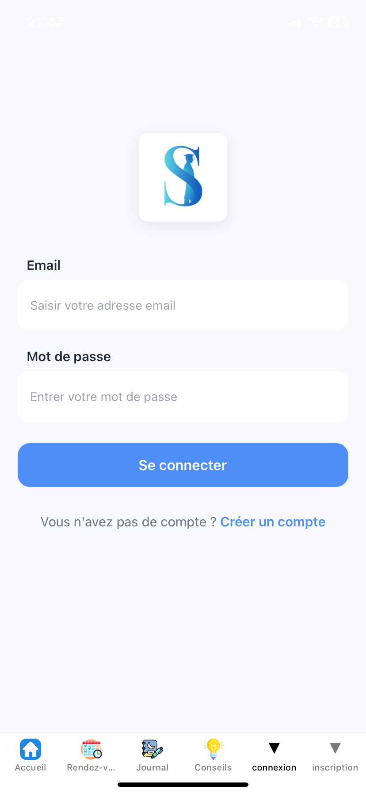
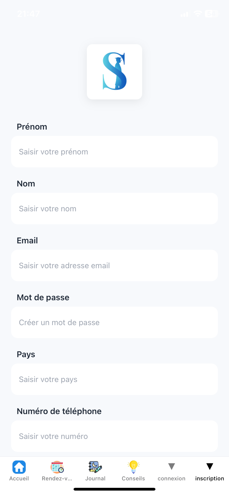

# Studenity Mobile

Application mobile de gestion du stress étudiant.

## Fonctionnalités

- Création de compte
- Connexion utilisateur
- Journal personnel
- Historique du journal
- Sélection d’humeur
- Liste de psychologues
- Prise de rendez-vous

## Technologies

Frontend
- React Native
- Expo Router

Backend : https://github.com/xebec91/studenity-backend
- Node.js
- Express

Base de données
- PostgreSQL

## Architecture

Application mobile React Native connectée à une API Node.js avec une base PostgreSQL.

## Aperçu de l'application

## Auteur

Projet développé par Xebec
